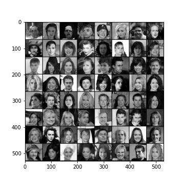
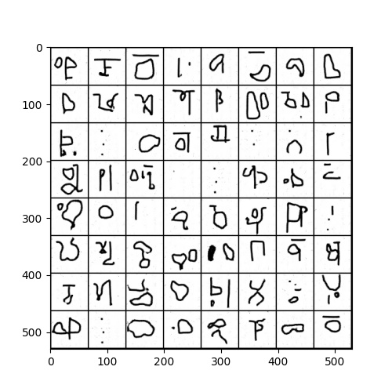
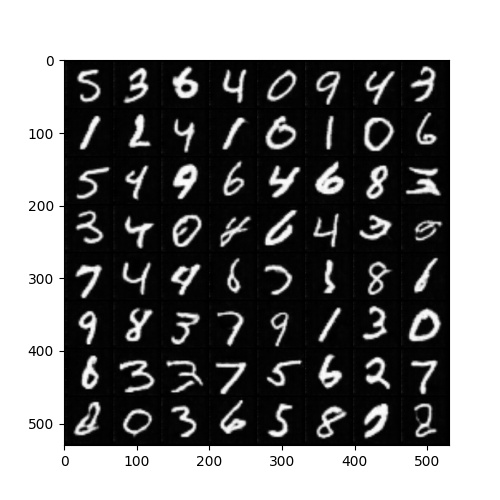

# Generative Adversarial Networks with Fast Fourier Convolutions
 
 
## Introduction
 
**Generative Adversarial Networks with Fast Fourier Convolutions** is a tool for image generation via deep neural networks. It
applies the ideas of Fast Fourier Convolutions, as presented by Lu Chi et al. (2020), to replace the usual convolution layers. It was implemented with PyTorch and uses the DCGAN architecture as a starting point.
 
Many related works focus on the task of image classification, image inpainting, and image segmentation. This application highlights the effect of fourier convolutions on the task of image generation - a domain which is still under-explored for the application of this method.
 
 
## Data
 
The implementation allows the use of four datasets from Torchvision, manely [MNIST](http://yann.lecun.com/exdb/mnist/), [CIFAR-10](https://www.cs.toronto.edu/~kriz/cifar.html), [CelebA](https://mmlab.ie.cuhk.edu.hk/projects/CelebA.html), and [Omniglot](https://github.com/brendenlake/omniglot).
 
The MNIST database of handwritten digits and has a training set of 60,000 example with 10 classes. The CIFAR-10 dataset consists of 60000 32x32 colour images in 10 classes, with 50000 training images. CelebA is a large-scale face attributes dataset with more than 200K celebrity images. Omniglot contains 1623 different handwritten characters from 50 different alphabets.
 
## Using the repository
 
### Installing via Anaconda
 
```
conda create --name ffc-gan python=3
conda activate ffc-gan
git clone https://github.com/phbgomes22/FastFourierConvolution.git
cd FastFourierConvolution
pip install -r requirements.txt
```
 
### Training models
 
You can train the model using the script
 
```
python train.py
```
 
Below, the list of possible arguments for the script. To get the full list of possible parameters, you can call the `--help` flag when calling the script.
 
 
| Flag | Description | Values |
| --- | --- | --- |
| -g / --generator | Choose the type of generator you want the model to use | ffc / vanilla |
| --dataset | Choose the dataset you will use - leave it empty for local dataset with default folder in `../data/` | MNIST / CIFAR10 / CelebA / OMNIGLOT |
| --data_path | The path of the training data. Only need to specify it if `--dataset` is not used | The path of the local dataset |
| --debug | Choose if running with debug prints or not | - |
| --color | Choose the color scheme for the images to be generating | greyscale / colorized |
| -o / --output | The path to the output to store the trained models. Default is `../output/` | The path of the output |
| -e / --epochs | Number of iterations for the training. Default is 400. | Any positive integer value |
| -b / --batch_size | ize of the batch size for the training. Default is 128. | Any positive integer value |
 
 **Note**
The Dataloader expects a dataset with the format `{dir_name}/{class_names}/{images}`. Make sure that the dataset specified in `--data_path` follows this format of directory organization. 


An example for training the FFC-DCGAN for the MNIST dataset with 600 epochs and a batch size of 256 is
 
```
python train.py -g ffc --dataset MNIST -e 600 -b 256
```
 
### Generating samples
 
After training a model, you can generate images by loading the weights of the trained model with the script
 
```
python test.py
```
 
Below, the list of possible arguments for the script. To get the full list of possible parameters, you can call the `--help` flag when calling the script.
 
| Flag | Description | Values |
| --- | --- | --- |
| --model_path | The path to the pre-trained model weights. |  |
| -n / --number | Number of samples that the generator will create. Default is set to `1000`. | Any positive integer value |
| -o / --output | The path for the generated samples output. Default is `../generated_samples/` | |
| -g / --generator | The type of generatator you used for the training of the model | ffc / vanilla |

 
An example for generating 10.000 images for a trained ffc model from epoch 100 in an folder `../output/` is
 
```
python test.py -g ffc --model_path ../output/generator100_0 -n 10000
```

## Results
 
Results for the CelebA, Omniglot, and MNIST datasets

<p align="center">
  
  
  
</p>

 
## References
 
1. Chi, Lu, Borui Jiang, and Yadong Mu. "Fast fourier convolution." Advances in Neural Information Processing Systems 33 (2020): 4479-4488.

